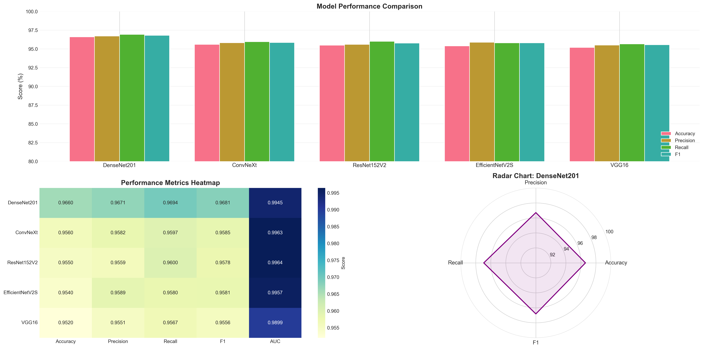
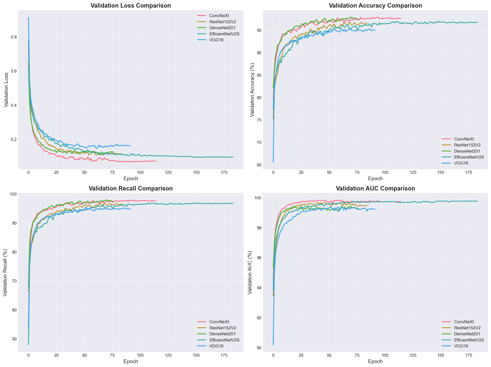
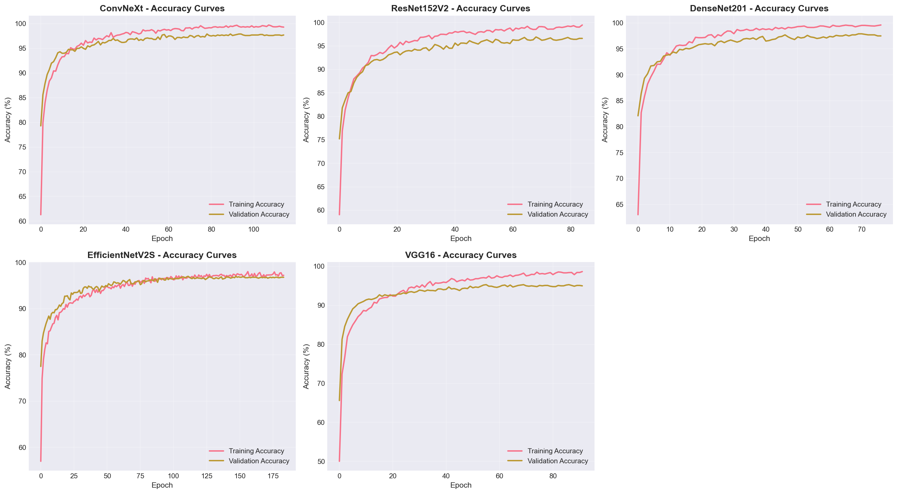
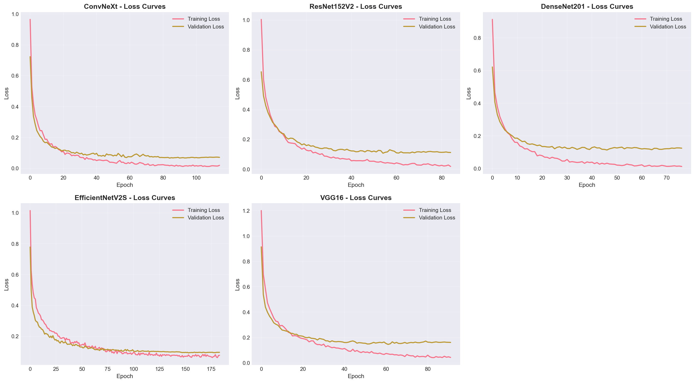
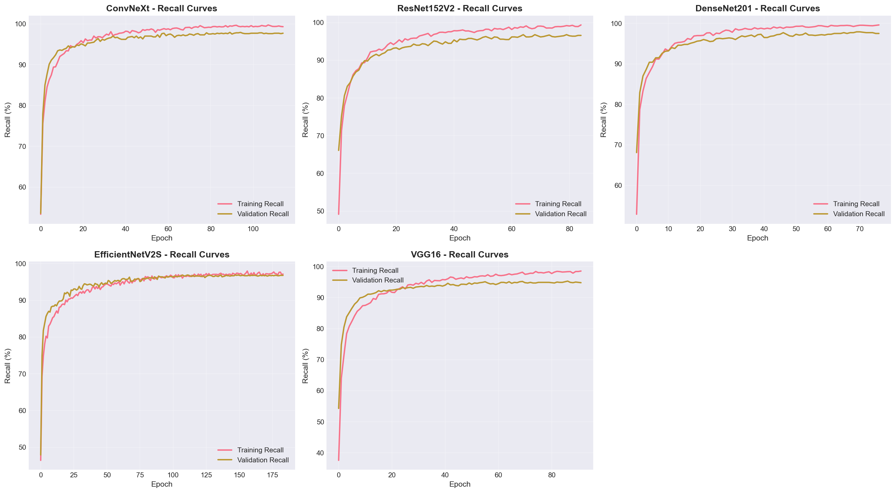
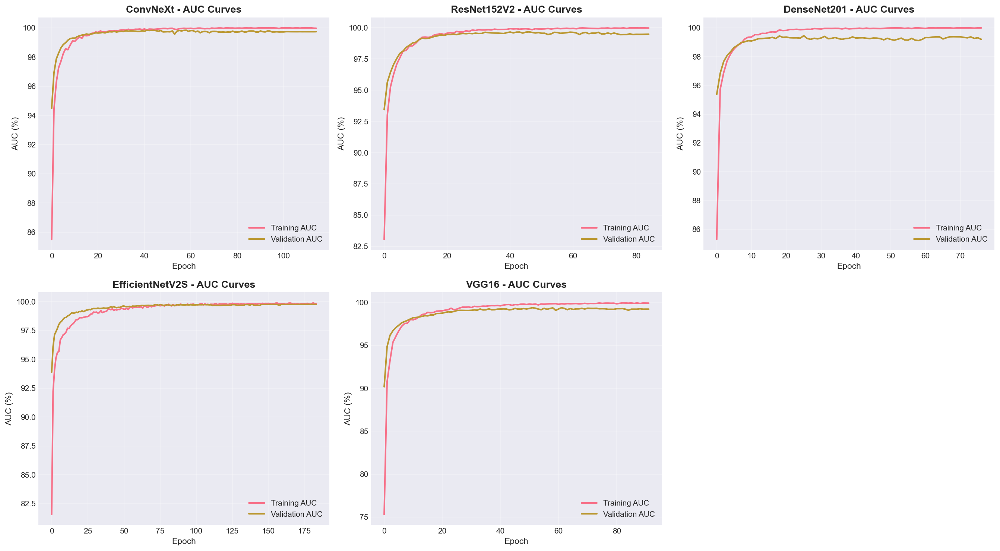
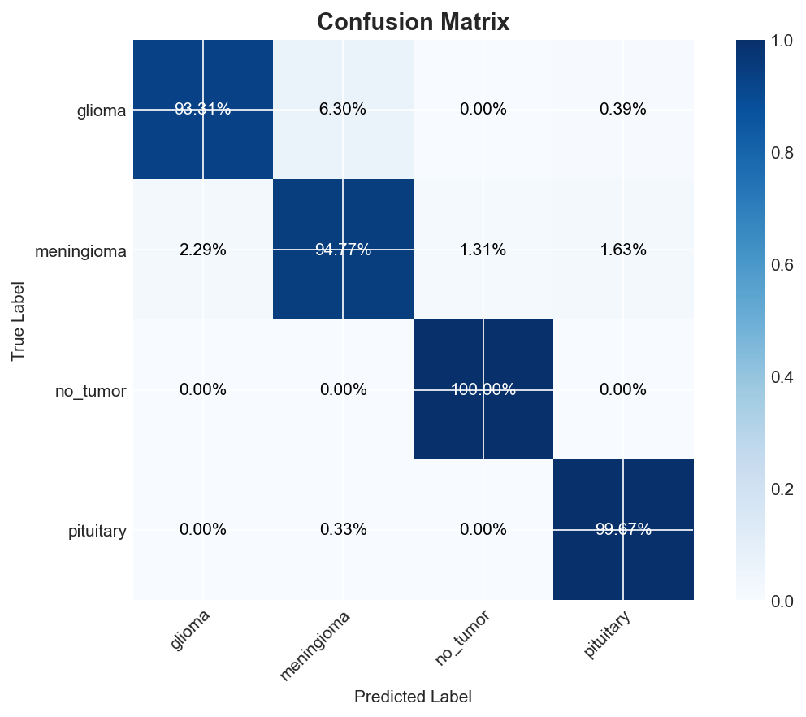
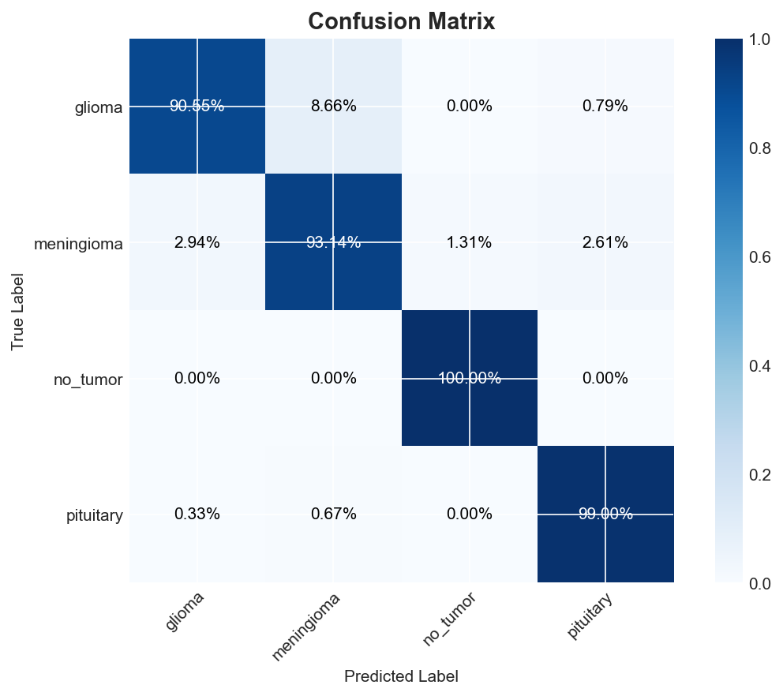

# 🧠 AI-Assisted Brain Tumor Localization and Classification

<div align="center">


**A deep learning framework for brain tumor detection and localization using MRI images**

[Features](#-features) • [Installation](#-installation) • [Usage](#-usage) • [Models](#-models) • [Dataset](#-dataset) • [Results](#-results)

</div>

---

## 📋 Overview

This project is a comprehensive deep learning solution for medical imaging analysis, designed to assist in automated brain tumor detection and localization.

### ✅ Phase 1: Classification 
- **Robust Classification**: Classifying MRI slices into 4 categories: **Glioma**, **Meningioma**, **Pituitary**, and **No Tumor**.
- **Advanced Architectures**: Transfer learning with ConvNeXt, EfficientNetV2, ResNet, DenseNet, and VGG.
- **Medical Metrics**: Rigorous evaluation optimized for medical diagnosis support.

### ✅ Phase 2: Segmentation 
- **Tumor Localization**: Pixel-wise localization of tumor regions using U-Net variants.
- **Multiple Architectures**: UNet, AttentionUNet, ResUNetPP, SwinUNet with ResNet50 backbone.
- **Advanced Loss Functions**: BCE-Tversky, Focal Tversky, Dice, and combined losses.

---

## ✨ Features

### ✅ Classification 
- 🏗️ **Multiple Architectures**: ResNet, DenseNet, VGG, EfficientNetV2, ConvNeXt.
- 🔧 **Modular Design**: Production-ready codebase offering easy extensibility.
- ⚙️ **YAML Configuration**: Centralized hyperparameter management.
- 📊 **Medical Metrics**: Optimized for Recall and F1-Score to minimize false negatives.
- 📈 **Class Balancing**: Automatic weight computation for imbalanced datasets.
- 🎨 **Visualizations**: Comprehensive performance plots (AUC, Confusion Matrices).

### ✅ Segmentation 
- 🧩 **Multiple Architectures**: UNet, AttentionUNet, ResUNetPP, SwinUNet with ResNet50 backbone.
- 🎯 **Mask Generation**: Precise tumor boundary detection with visualization.
- ⚙️ **YAML Configuration**: Centralized hyperparameter management.
- 📐 **Medical Metrics**: Dice, IoU, Sensitivity, Specificity, Precision.
- 🔥 **Advanced Losses**: BCE-Tversky (default), Dice, Focal Tversky, and more.
- 🎨 **Albumentations**: Advanced data augmentation for segmentation.

---

## 📁 Project Structure

```text
AI-Assisted-Brain-Tumor-Localization-and-Classification/
├── configs/                    # YAML configuration files
│   ├── classification_config.yaml
│   └── segmentation_config.yaml
├── data/                       # Dataset directory
│   └── brisc2025/
│       ├── classification_task/ # Classification dataset
│       └── segmentation_task/   # Segmentation dataset
├── notebooks/                  # Jupyter notebooks
│   ├── evaluate_all_models.ipynb
│   ├── train_classification.ipynb
│   ├── test_classification.ipynb
│   ├── train_segmentation.ipynb
│   └── test_segmentation.ipynb
├── scripts/                    # Executable training/inference scripts
│   ├── train_classifier.py
│   ├── evaluate_classifier.py
│   ├── predict_single.py
│   ├── train_segmentor.py
│   └── predict_mask.py
├── src/                        # Main source package
│   ├── classification/         # Classification module 
│   ├── segmentation/           # Segmentation module 
│   └── utils/                  # Shared utilities
├── weights/                    # Saved model weights
├── logs/                       # Training logs
├── setup.py                    # Package installation
├── requirements.txt            # Dependencies
└── README.md
```

---

## 🚀 Installation

### Prerequisites
- Python 3.8+
- CUDA-compatible GPU (recommended for training)

### Setup

```bash
# Clone the repository
git clone https://github.com/Qadeer-Haider/AI-Assisted-Brain-Tumor-Localization-and-Classification-in-Medical-Imaging.git
cd AI-Assisted-Brain-Tumor-Localization-and-Classification-in-Medical-Imaging

# Create virtual environment
python -m venv venv
source venv/bin/activate  # On Windows: venv\Scripts\activate

# Install dependencies
pip install -r requirements.txt

# Install package in development mode
pip install -e .
```

---

## 💻 Usage

### Classification

#### Training

```bash
# Train with default configuration (ConvNeXt)
python scripts/train_classifier.py

# Train specific model
python scripts/train_classifier.py --model ResNet152V2 --epochs 100
```

#### Evaluation

```bash
# Evaluate trained model
python scripts/evaluate_classifier.py --weights weights/classification/ConvNeXt_best_weights.keras
```

#### Prediction

```bash
# Predict single image
python scripts/predict_single.py \
    --image data/brisc2025/classification_task/test/glioma/sample.jpg \
    --weights weights/classification/ConvNeXt_best_weights.keras
```

### Segmentation

#### Training

```bash
# Train with Jupyter notebook (recommended)
jupyter notebook notebooks/train_segmentation.ipynb

# Or use CLI with default configuration (UNet + BCE-Tversky)
python scripts/train_segmentor.py

# Train specific model
python scripts/train_segmentor.py --model AttentionUNet --loss bce_tversky

# Train with config file
python scripts/train_segmentor.py --config configs/segmentation_config.yaml
```

#### Prediction

```bash
# Predict single image
python scripts/predict_mask.py \
    --image data/brisc2025/segmentation_task/test/images/sample.jpg \
    --model weights/segmentation/UNet_bce_tversky_best.keras \
    --visualize

# Predict directory of images
python scripts/predict_mask.py \
    --input-dir data/brisc2025/segmentation_task/test/images \
    --model weights/segmentation/UNet_bce_tversky_best.keras \
    --output-dir outputs/predictions
```

---

## 🏗️ Models

### Classification Models

We leverage state-of-the-art architectures initialized with ImageNet weights and fine-tuned for medical imaging:

| Model | Parameters | Best Use Case |
| :--- | :--- | :--- |
| **ConvNeXt** | ~88M | State-of-the-art performance |
| **EfficientNetV2** | ~21M | Balance of speed & accuracy |
| **ResNet152V2** | ~58M | Deep feature extraction |
| **DenseNet201** | ~18M | Feature reuse & efficiency |
| **VGG16** | ~14M | Classic baseline |

### Segmentation Models

We use **keras-unet-collection** for advanced segmentation architectures:

| Model | Description | Best Use Case |
| :--- | :--- | :--- |
| **UNet** | Standard U-Net with ResNet50 backbone | General segmentation |
| **AttentionUNet** | U-Net with attention gates | Fine boundary detection |
| **ResUNetPP** | Residual U-Net with ASPP | Multi-scale features |
| **SwinUNet** | Transformer-based segmentation | State-of-the-art |

#### Loss Functions

| Loss | Description |
| :--- | :--- |
| **bce_tversky** (default) | BCE + Tversky combined - balanced and robust |
| **dice** | Dice loss - direct optimization of Dice score |
| **dice_bce** | Dice + BCE - pixel and region optimization |
| **tversky** | Tversky loss - adjustable FP/FN penalties |
| **focal_tversky** | Focal Tversky - focus on hard regions |

---

## 📊 Dataset

This project uses the **BRISC2025** (Brain Tumor Image Segmentation & Classification) dataset, which includes both classification and segmentation tasks.

### Classification Dataset
- **6,000** T1-weighted MRI slices (5,000 train / 1,000 test)
- **4 classes**: Glioma, Meningioma, Pituitary Tumor, No Tumor
- **3 anatomical planes**: Axial, Coronal, Sagittal

### 🔄 Data Splitting Strategy

To ensure robust evaluation and prevent data leakage, we utilize **Stratified Splitting** techniques:

**For Classification:**

1.  **Stratification Method**: Data is stratified based on *both* **Tumor Class** and **Anatomical Plane** (Axial, Coronal, Sagittal). This ensures that every subset of data preserves the original distribution of tumor types and viewing angles.
2.  **Split Ratios**:
    - **Train**: 80% (Model optimization)
    - **Validation**: 20% (Hyperparameter tuning & early stopping)
    - **Test**: Separate hold-out set (~1,000 images)

**For Segmentation:**
1.  **Stratification Method**: Image-mask pairs are stratified based on **Tumor Class** and **Anatomical Plane** (similar to classification) to ensure balanced representation and prevent data leakage.
2.  **Split Ratios**:
    - **Train**: 80% (Model optimization)
    - **Validation**: 20% (Hyperparameter tuning & early stopping)
    - **Test**: Separate hold-out set

### Citation

```bibtex
@article{fateh2025brisc,
  title={Brisc: Annotated dataset for brain tumor segmentation and classification with swin-hafnet},
  author={Fateh, Amirreza and Rezvani, Yasin and Moayedi, Sara and others},
  journal={arXiv preprint arXiv:2506.14318},
  year={2025}
}
```

---

## 🔍 Performance Visualization

Here are the comparative results of our trained models. **DenseNet201** and **ConvNeXt** demonstrated superior performance across key metrics.

### 🏆 Comprehensive Model Evaluation


### 📊 Model Comparison Summary


### 📉 Training Dynamics
<div align="center">
  
  
</div>

### 🎯 Metric Analysis (Recall & AUC)
<div align="center">
  
  
</div>

### 🧩 Confusion Matrices

<details>
<summary><b>Click to view individual model confusion matrices</b></summary>

<div align="center">

#### DenseNet201 (Best Model)


#### ConvNeXt


#### ResNet152V2


#### EfficientNetV2S


#### VGG16


</div>

</details>

---

## 📈 Results

Test set performance on **1,000 T1-weighted MRI slices** from the BRISC2025 dataset:

| Model | Accuracy | Precision | Recall | F1 Score | AUC |
| :--- | :---: | :---: | :---: | :---: | :---: |
| **DenseNet201** | 96.60% | 96.71% | 96.94% | 96.81% | 99.45% |
| **ConvNeXt** | 95.60% | 95.82% | 95.97% | 95.85% | 99.63% |
| **ResNet152V2** | 95.50% | 95.59% | 96.00% | 95.78% | 99.64% |
| **EfficientNetV2S** | 95.40% | 95.89% | 95.80% | 95.81% | 99.57% |
| **VGG16** | 95.20% | 95.51% | 95.67% | 95.56% | 98.99% |

> **Best Performing Model:** DenseNet201 with **96.60%** accuracy.

*All models use transfer learning with frozen backbones and custom classification heads.*

---

## 🗺️ Roadmap

- [x] **Phase 1: Classification**
    - [x] Data Loading & Preprocessing
    - [x] Model Implementation (ConvNeXt, EfficientNet, etc.)
    - [x] Training Pipeline & Logging
    - [x] Evaluation & Visualization
- [x] **Phase 2: Segmentation**
    - [x] U-Net Architecture Implementation (UNet, AttentionUNet, ResUNetPP, SwinUNet)
    - [x] Mask Data Processing with Albumentations
    - [x] Segmentation Training Loop with Advanced Losses
    - [x] Mask Prediction & Visualization
    - [x] Modular Codebase Structure
- [ ] **Phase 3: Deployment**
    - [ ] Web Interface (Streamlit)
    - [ ] Docker Containerization
    - [ ] ONNX Export

---

## 📄 License

This project is licensed under the MIT License - see the [LICENSE](LICENSE) file for details.

---

## 🙏 Acknowledgments

- **BRISC2025** dataset creators and annotators.
- **TensorFlow** team for pre-trained models.
- Medical imaging research community.

---

<div align="center">

**Built with ❤️ by [Qadeer Haider](https://github.com/Qadeer-Haider)**

</div>
